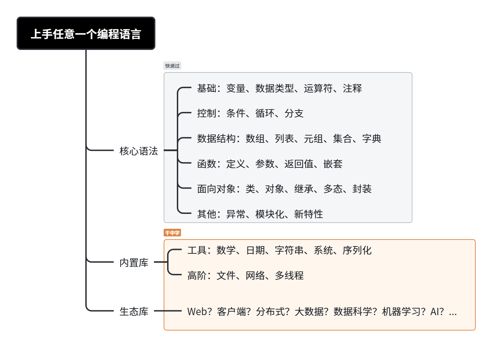

# 1. 速通编程


# 2.基础
官网：[https://www.rust-lang.org/zh-CN/](https://www.rust-lang.org/zh-CN/)

# 3.环境
入门：[https://www.rust-lang.org/zh-CN/learn/get-started](https://www.rust-lang.org/zh-CN/learn/get-started)
命令：
```
# 初始化项目
cargo init

# 新建项目（会创建新文件夹）
cargo new rust-demo

# 运行项目
cargo run

# 构建
cargo build

# 新增依赖
cargo add

# rustc 编译
rustc xxx
```
2.语法（通过提示词让ai提供对应语法实例）
```
我想要学习rust，帮我创建出各种.rs文件，命名带上数字序号，详细说明rust中的各种语法和功能，包括：变量、数据类型、函数、流程控制、所有权、结构体、枚举和模式匹配、常见集合及操作、包和模块、错误处理、泛型、Trait、生命周期等
```

# 3.所有权系统
xxxx

# 4.资料
xxxx

学习基础来源：[雷丰阳](https://www.bilibili.com/video/BV1Tnd2BDEBp/?spm_id_from=333.788.videopod.episodes&vd_source=1c022aa48e65cf37e6ffeb9f30cd084d&p=2)